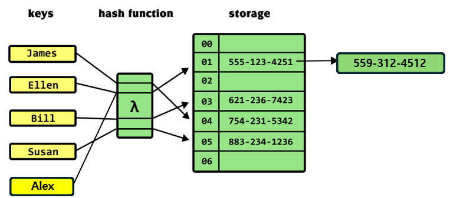

# 해시란?

데이터를 더 빠르게 조회하기 위해 데이터를 고유한 값(해시 값)으로 매핑하는 기법

## 충돌 시

## 시간 복잡도

| 비교       | 배열 | 해시            |
| ---------- | ---- | --------------- |
| 시간복잡도 | O(n) | O(1) (충돌X 시) |

출처: [khalilstemmler](https://khalilstemmler.com/blogs/data-structures-algorithms/hash-tables/)
