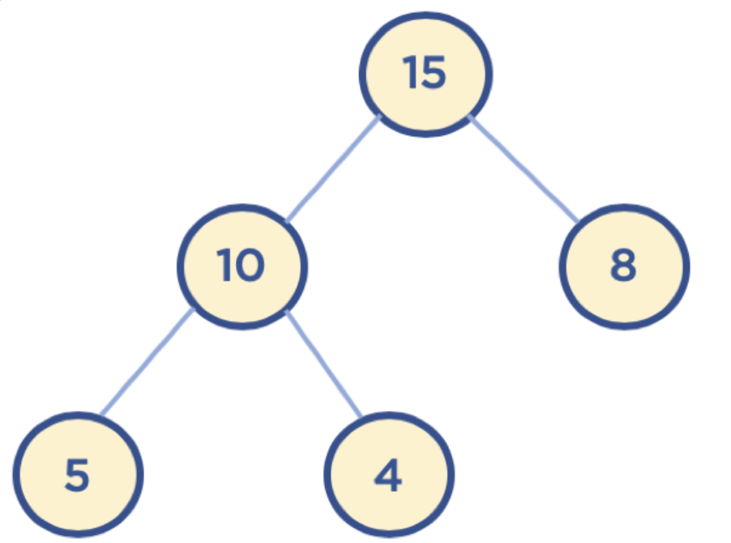
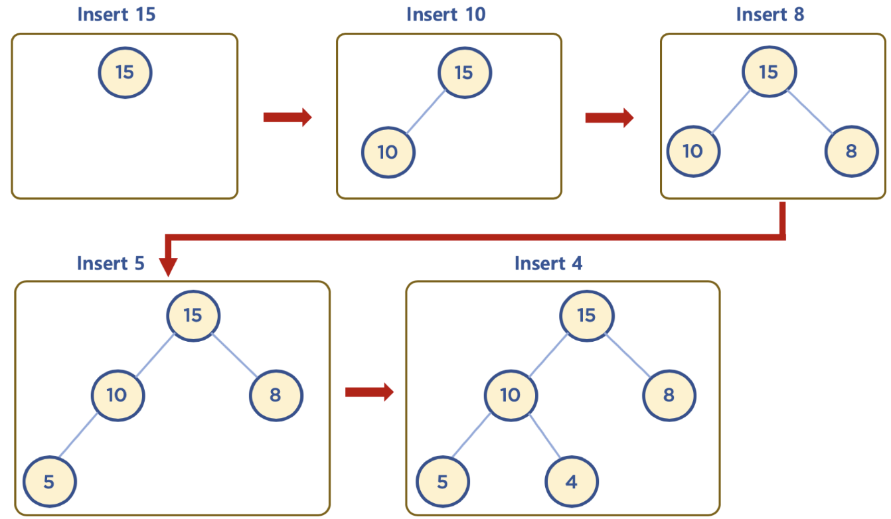
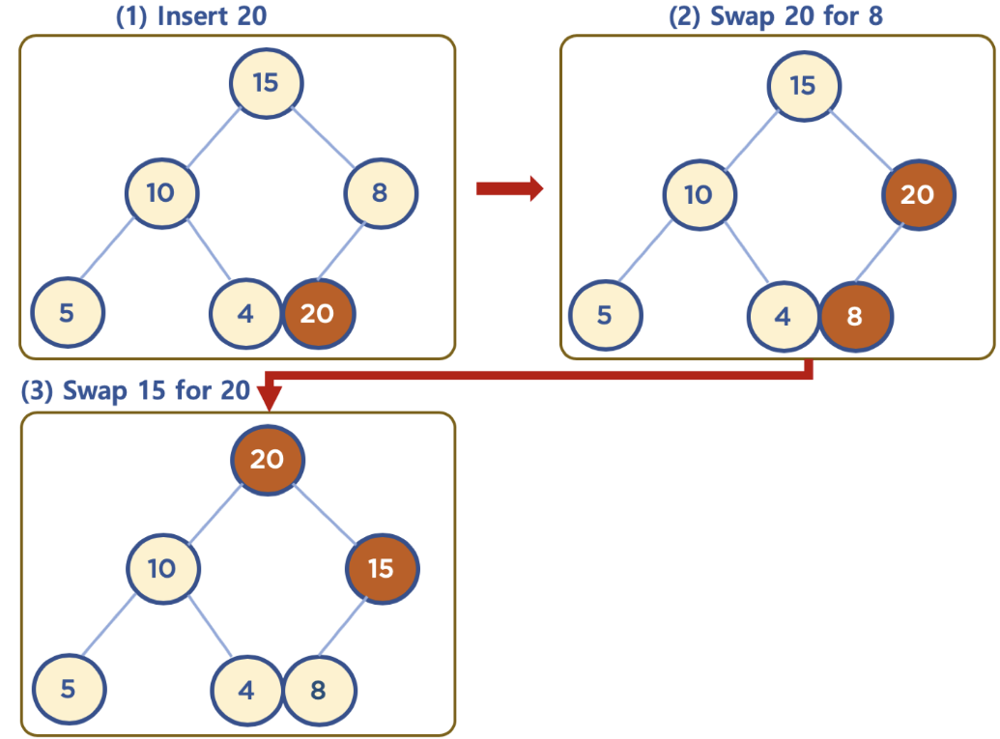
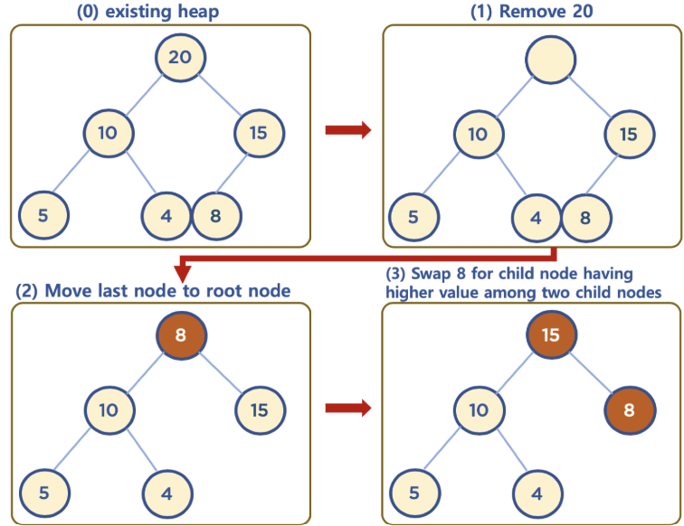

# 힙이란?

데이터에서 최대값과 최소값을 빠르게 찾기 위해 고안된 완전 이진 트리

## 데이터 삽입

## 데이터 삭제

## 시간 복잡도

| 비교       | 배열 | 힙      |
| ---------- | ---- | ------- |
| 시간복잡도 | O(n) | O(logn) |

## Queue? PriorityQueue?

| 구조      | Queue               | PriorityQueue                |
| --------- | ------------------- | ---------------------------- |
| 동작 방식 | FIFO                | Heap 구조                    |
| 삽입 순서 | 들어간 순서대로     | 우선순위 정렬                |
| 내부 구조 | LinkedList or Array | 완전 이진 트리(배열 기반 힙) |

## 자료 구조 시각화

[힙 시각화](https://www.cs.usfca.edu/~galles/visualization/Heap.html)

출처: [잔재미코딩](https://www.fun-coding.org/post/Chapter11-heap.html#gsc.tab=0)
